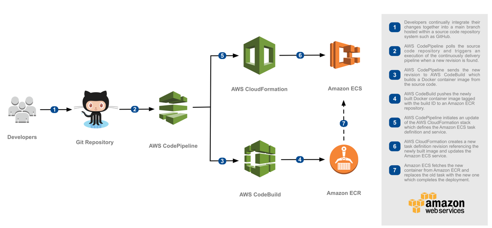

# Docker on Amazon ECS(Fargate) with Continuous Delivery

I'm using Continuous Deployment to demonstrate how to achieve it of an application on Amazon Elastic
Container Service(Amazon ECS) using AWS CodePipeline and AWS CodeBuild. In this way, revisions are deployed to the right environment automatically without needed approval from a developer or manager, making the software release automated.

- Containerize Application
- Build a docker image and push to ECR
- CF stack to create VPC, Subnet, etc
- CF stack to create ECS Cluster, Loadbalancer, Listener, Security groups, etc
- CF stack to deploy docker container
- Continuous Delivery with AWS CodePipeline and AWS CodeBuild

I've used the ip range `10.0.0.0/16`, but it can be passed as a param

## Built With

I decided to use the following AWS technologies because AWS includes various tools and services designed to help users.

* [GitHub](https://github.com/)
* [Amazon S3](https://aws.amazon.com/s3/)
* [Amazon ECR](https://aws.amazon.com/ecr/)
* [Amazon ECS](https://aws.amazon.com/ecs/)
* [Amazon Fargate](https://aws.amazon.com/fargate/)
* [Amazon CodeBuild](https://aws.amazon.com/codebuild/)
* [Amazon CodePipeline](https://aws.amazon.com/codepipeline/)
* [Amazon Command Line Interface](https://aws.amazon.com/cli/)
* [Amazon CloudFormation](https://aws.amazon.com/pt/cloudformation/)

## Why Amazon Fargate

AWS Fargate is a technology for Amazon ECS that allows you to run containers without having to manage servers or clusters.
I actually believe that Containers as a Service (CaaS) is the real PaaS that developers have been waiting for years. It allows developers to deploy their containers directly in the cloud without having to worry about everything in between.

### Prerequisites

What things you need to install the software

```
AWS Account
GitHub Account
AWS CLI
S3 Bucket
```

## Getting Started

These instructions will get you a copy of the project up and running on AWS environment for development and hiring process purposes. See deployment for notes on how to deploy the project on a system.

### Installing

A step by step series of examples that tell you how to get a development environment running

### Cloning source code

In order to proceed a continuous deployment is necessary that you have your source code on a GitHub repository.
Create a repository in your GitHub account, unzip the `ceros-sky.zip` and push the source code of the ceros-sky application or [Fork](https://github.com/rverli/ceros-sky.git) the GitHub repository.
it's the same sky code, the only change is that I added a Dockerfile on the main folder of ceros-sky
project.

### Sending templates files to S3 Bucket

First of all, you need to create an S3 Bucket as a prerequisite to store the templates and the artifacts that the application has generated.

Once the deploy-s3 script was executed, the script will copy all necessary files to execute the application to your S3 Bucket folder. 
Please, make sure that all the files are there.

- Main CF template file of the application (ecs-continuous-delivery.yaml)
- All the CF templates to create your Stacks (/template/*)

```
# From the main folder
# ./scripts/deploy-s3 <S3-BUCKET-NAME>
```

### Running the process 

To create stacks and all the infrastructure necessary to have the work done, first, you need to execute the 
init script file and then waiting to the first deploy finish.

```
# From the main folder
# ./scripts/init.sh <GITHUB-USER> <GITHUB-TOKEN> <S3-BUCKET-NAME>

[GitHub Token](https://github.com/settings/tokens)
```

The `ecs-continuous-delivery.yaml` stack has as Output two variables:

- CodePipelineUrl - The continuous deployment pipeline in the AWS Management Console, where you can follow the deployment steps until the process finished. [AWS CodePipeline Console](https://console.aws.amazon.com/codesuite/codepipeline/pipelines)
- ApplicationUrl - The service that is being continuously deployed, where you can access the application through
your browser.

Once the init.sh script was executed, the script will create all CloudFormation stacks necessaries and deploy the API on Amazon ECS, it can take a few minutes.

### Deploying a new release

In order to deploy a new release you simply should push your changes to your GitHub repository and wait to AWS CodeBuild and AWS CodePipeline making the work hard for you, it's the magic of the continuous delivery.

### Images Repository

The docker images created for the solution will be stored and used from Amazon ECR.

## Test your Deploy

To make sure that your last version is deployed and working, see through the PipelineUrl if the deploy is completed and the work is done with success. [AWS CodePipeline Console](https://console.aws.amazon.com/codesuite/codepipeline/pipelines)

### Cleaning up the example resources

To remove all resources created by this code challenge, do the following:

1. Delete the main CloudFormation stack which deletes the substacks.
2. Manually delete resources that can contain content:

    - S3 Bucket -> ArtifactBucket
    - ECR Repository -> Repository

## Continuous deployment to Amazon ECS

Here’s a reference architecture that puts these components together to deliver a continuous deployment pipeline of Docker applications onto ECS:



This architecture demonstrates how to deploy containers onto ECS and ECR using CodePipeline to build a fully automated continuous deployment pipeline on top of AWS. This approach to continuous deployment is entirely serverless and uses managed services for the orchestration, build, and deployment of your software.

## Versioning

I've used [GitHub](http://github.com/) for versioning. For Clone or Fork the code, see the [tags on this repository](https://github.com/rverli/ecs-fargate-continuous-deployment.git). 

## Authors

* **Renan Verli** 
